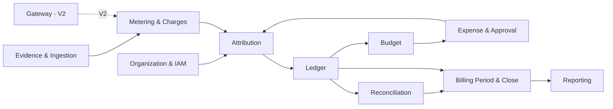
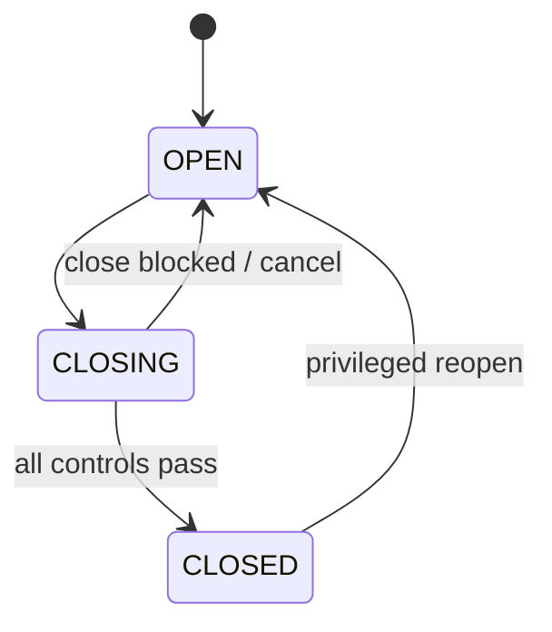
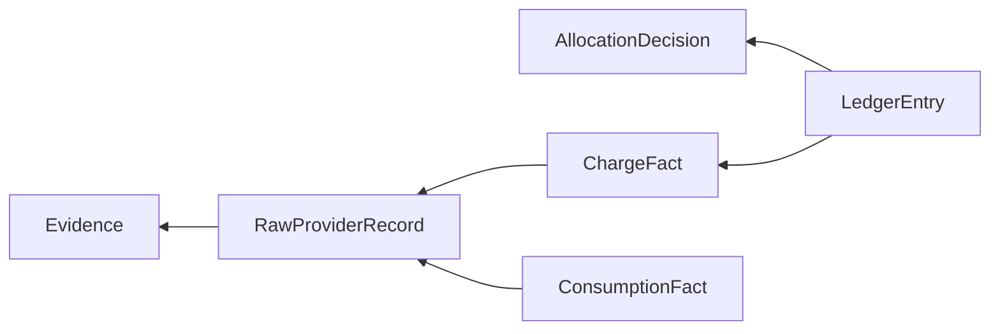

# 07. Canonical Domain Model v0.1

> 本文描述领域概念和边界，不是数据库 DDL。

## 1. Context Map



---

## 2. Bounded Context / Module

### 2.1 Organization & IAM

负责：

- Employee；
- Team；
- Project；
- Cost Center；
- Role；
- data scope。

不负责 Provider external identity。

---

### 2.2 Evidence & Ingestion

Aggregate：

```text
Evidence
ImportBatch
RawProviderRecord
```

职责：

- 文件接收；
- checksum；
- object storage；
- Provider/source detect；
- parser version；
- raw record；
- import lifecycle；
- retry/replay。

不做：

- 费用正式入账；
- 内部项目归属。

---

### 2.3 Metering & Charges

核心对象：

```text
ConsumptionFact
PricingFact
ChargeFact
```

一条 Provider raw record：

- 可能只产生 Consumption；
- 可能只产生 Charge；
- 可能产生多个 Consumption/Charge components；
- 不要求 1:1。

---

### 2.4 Attribution

核心对象：

```text
AttributionHint
AllocationRule
AllocationDecision
```

决策顺序可设计为：

```text
Explicit employee selection
→ exact provider key rule
→ provider project rule
→ organization/default rule
→ unresolved
```

这个顺序是产品设计，不是行业事实，后续可配置。

Allocation Decision 必须保存：

```text
source
rule_id
rule_version
actor
reason
```

---

### 2.5 Expense & Approval

核心对象：

```text
ExpenseClaim
ApprovalCase
```

Expense 是 employee-pay 场景。

企业统一 Provider account 的 statement import 不需要伪装成 Expense Claim。

---

### 2.6 Budget

核心对象：

```text
Budget
BudgetCommitment
```

V1 公式语义：

```text
available
= total_budget
- actual_posted
- outstanding_commitments
```

Actual spend 和尚未消费的 Commitment 都占用预算容量。

已经发生的 Provider cost 即使使 `available < 0` 也必须保留/入账；Budget 负责暴露 overrun，而不是过滤历史事实。

V2 再引入：

```text
Reservation
```

---

### 2.7 Ledger

核心对象：

```text
LedgerEntry
CorrectionGroup
```

Ledger Entry 来源可以是：

```text
PROVIDER_CHARGE
EXPENSE_REIMBURSEMENT
PURCHASE
CREDIT
ADJUSTMENT
```

关键属性：

```text
entry_id
billing_period
amount
currency
allocation
source_reference
posting_status
posted_at
```

一条 Entry 必须存在明确 lineage。

---

### 2.8 Reconciliation

核心对象：

```text
Statement
Invoice
ReconciliationRun
ReconciliationCase
```

匹配不要求都是逐 Request。

系统需要支持：

```text
Billing-period-level
Account-level
Project-level
Line-item-level
```

因为 Provider 粒度不同。

---

### 2.9 Billing Period & Close

Aggregate：

```text
BillingPeriod
```

候选状态：



`reopen` 是敏感操作，需要独立权限和 Audit。

---

## 3. Fact Model

### ConsumptionFact

建议语义：

```text
id
provider
service
model
meter_code
quantity
unit
period_start
period_end
time_grain
raw_record_id
```

Nullable hint dimensions：

```text
provider_org
provider_project
provider_user
provider_api_key
```

---

### PricingFact

```text
id
raw_record_id
pricing_quantity
pricing_unit
observed_unit_price
pricing_currency
pricing_rule_ref?
```

如果外部数据无法证明：

> 不创建/留空。

---

### ChargeFact

```text
id
provider
charge_category
provider_reported_amount
currency
funding_source?
payable_amount?
paid_amount?
outstanding_amount?
period
raw_record_id
```

不要让所有 Provider 为了统一都强行填满所有金额字段。

---

## 4. Lineage

这是 V1 的核心非功能语义：



最低要求：

> 每条正式 Ledger Entry 能追到至少一个 Evidence。

---

## 5. Money / Currency

### Money Value Object

```text
amount: Decimal
currency: ISO-4217 code where applicable
```

规则：

- 禁止 double/float；
- 内部不默认全部 CNY；
- V1 可以**展示原币种**，不必须自动做汇率折算；
- 如果做 FX，必须有 rate source / rate date / version；
- 未实现 FX 时，不允许跨币种直接求总和。

---

## 6. Cost Semantics

为避免“cost”一词混乱，领域设计遵循：

```text
Provider Reported Charge
→ External/Billed/Payable semantics
→ Internal Allocated Ledger
```

以下值可能不同：

```text
resource consumption value
provider reported charge
cash paid amount
promotional credit
payable
internal allocated cost
reimbursable amount
```

V1 实现时只保留实际用到的最小子集。

---

## 7. Ledger Correction Model

错误示例：

```text
2026-08
WebPilot +100 CNY
```

后来确认应归 AI-Collab：

```text
Correction Group CG-001
  WebPilot  -100
  AI-Collab +100
```

旧记录仍存在。

Current View：

```text
sum(original + corrections)
```

---

## 8. Budget Model

### V1

```text
Total = 10,000
Actual posted = 3,200
Outstanding commitments = 4,000

Available = 2,800
```

Formula:

```text
available
= total
- actual
- outstanding_commitments
```

`actual` is already-incurred/posting cost. `outstanding commitment` is approved future obligation not yet consumed. Both consume budget capacity.

For an already-incurred Provider charge, a budget overrun cannot justify discarding the cost. The charge is posted and the overrun is exposed explicitly.

### V2

Add:

```text
Reserved
```

for in-flight Gateway requests:

```text
available
= total
- actual
- committed
- reserved
```

V1 does not pre-create the reservation model.

---

## 9. Provider Adapter Contract（概念）

```text
detect(Evidence)
parse(Evidence)
validate(Raw Records)
normalize(Raw Records)
```

输出：

```text
RawProviderRecord[]
NormalizationCandidate {
    consumptionFacts[]
    pricingFacts[]
    chargeFacts[]
    attributionHints[]
}
```

Adapter **不能**：

- 直接写 Ledger；
- 决定企业最终 allocation；
- 根据缺失数据猜价格。

---

## 10. Domain Events

V1 候选：

```text
EvidenceUploaded
ImportValidated
ImportConfirmed
ChargeAllocated
ExpenseApproved
LedgerPosted
LedgerAdjusted
BudgetCommitted
BudgetCommitmentReleased
ReconciliationOpened
ReconciliationResolved
BillingPeriodClosingStarted
BillingPeriodClosed
BillingPeriodReopened
```

是否真的使用 MQ 传播由架构决定；Domain Event 不等于必须 Kafka。

---

## 11. 已由 V0.2 / V1 Detailed Design 决定

Frozen:

```text
Spring Boot modular monolith
Plain MyBatis
MySQL 8.4 LTS
Redis in V1
React frontend
Docker Compose delivery
```

Physical schema, states, transactions and APIs are defined in `docs/detailed-design/`.

Still deferred:

```text
RabbitMQ until V1.5 need
Gateway/WebFlux until V2
Redis financial reservation until V2
exact FX strategy
complex approval DSL
microservices
```
