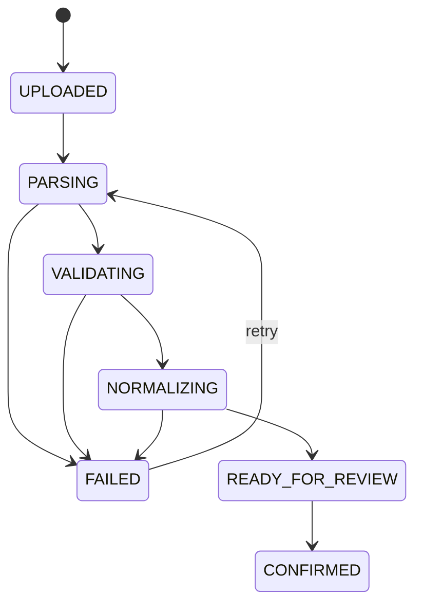
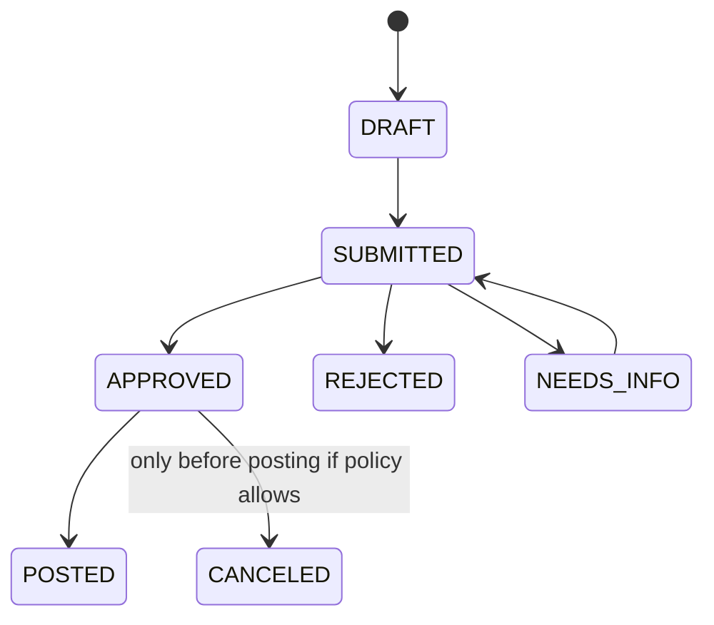
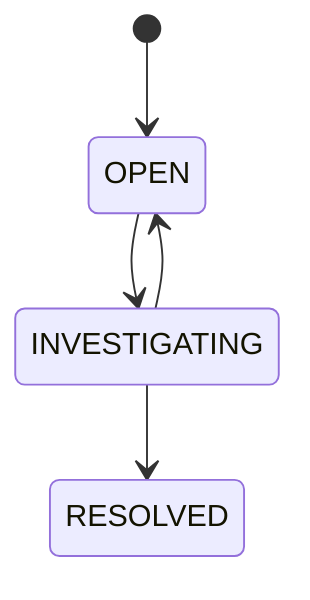
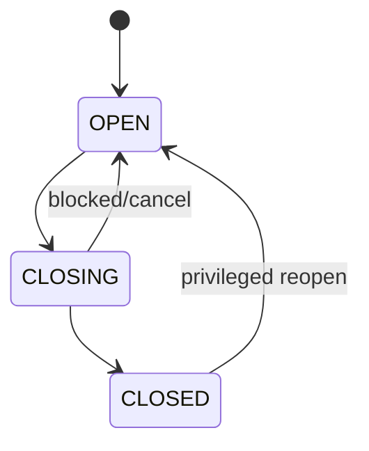

# 08. Business Rules & Invariants

> 这些规则必须尽量映射到自动测试。
> `INV-*` 是系统不变量；`POL-*` 是可配置业务策略；两者不要混淆。

## A. Evidence / Import

### INV-001 — Evidence 不等于正式账

上传成功不能直接创建 POSTED Ledger Entry。

### INV-002 — 原始 Evidence 必须可追溯

已经形成正式账的 Evidence 不允许物理删除；如需删除原文件必须有合规的 retention policy 和不可逆脱敏策略，V1 默认不开放。

### INV-003 — Parser 必须版本化

每次 normalization 必须能知道：

```text
provider
source_type
parser_version
schema_fingerprint
```

### INV-004 — 导入幂等

相同业务 Evidence 被重复提交不得造成重复正式账。

### INV-005 — File Hash 不是唯一业务幂等依据

重新保存文件可能改变 checksum；系统还需要 statement period / provider identity / record fingerprint 等业务维度。

### INV-006 — Import Retry 不得重复 Posting

Import crash 后重试，只能补齐未完成工作。

### INV-007 — Raw Record 不可因 Normalize 失败而丢失

失败记录进入可检查状态。

---

## B. Normalization

### INV-008 — 未知字段不可被静默猜测

例如 DeepSeek `wallet_type` 新值：

> 保留 raw，标记 UNKNOWN，而不是自动映射到 CASH。

### INV-009 — Consumption 与 Charge 可以不一一对应

系统模型不得要求：

```text
1 Usage == 1 Cost
```

### INV-010 — Pricing 不可反推

Provider 没有提供/官方无法证明单价时，不使用 `amount / token` 自动生成权威 PricingFact。

### INV-011 — Grain 必须保留

Month-level Kimi/GLM summary 不得伪装成 request-level fact。

### INV-012 — Money 使用 Decimal

禁止浮点作为正式金额计算。

---

## C. Attribution

### INV-013 — Provider identity 只是 Hint

Provider project / API key 不能直接等价内部 Project，除非存在显式 mapping rule。

### INV-014 — 无归属 Charge 不允许正式 POST

进入：

```text
UNALLOCATED
```

或等价 review 状态。

### INV-015 — Allocation 必须有来源

至少：

```text
MANUAL
RULE
EXPLICIT_SUBMISSION
```

### INV-016 — Allocation Rule 必须版本化

规则变化不能让历史 POSTED Ledger 自动漂移。

---

## D. Expense / Approval

### INV-017 — Expense Claim 必须关联 Evidence

不能只提交手工金额并直接报销。

### INV-018 — 已审批金额变化必须重新审批或走 Adjustment

审批后不能直接编辑 amount。

### POL-001 — 小额费用可自动批准

这是可配置策略，不是系统不变量。

### POL-002 — 超预算费用需要更高审批层级

可由企业配置。

---

## E. Budget

### INV-019 — Actual + Outstanding Commitment 不得被重复当作可用预算

```text
available
= total
- actual
- outstanding_commitments
```

激活 Commitment 时：

```text
requested <= available
```

并发创建不能让可承诺额度被重复消费。

对于已经发生的 Provider cost，即使造成预算超支也必须保留/入账，系统记录 over-budget，而不是隐藏历史事实。

### INV-020 — Commitment 的创建/释放必须原子

防止两个审批同时读取旧 available。

### INV-021 — 已取消 Commitment 不再占用额度

且重复 cancel 幂等。

### INV-022 — Actual Spend 不等于 Available

V1：

```text
available
= total
- actual
- outstanding_commitments
```

Commitment 被 actual 消费：

```text
actual += posted_amount
outstanding_commitment -= consumed_amount
```

---

## F. Ledger

### INV-023 — POSTED Entry 不允许 destructive update

正式账只能追加 Correction/Adjustment。

### INV-024 — POSTING 必须业务幂等

同一 source posting request 重试不能生成重复 entry。

### INV-025 — Ledger 必须有 Source Lineage

每条 entry 能追到：

```text
Evidence/Expense
+
Allocation
```

### INV-026 — Adjustment 必须引用被修正事实/原因

不允许匿名“改账”。

### INV-027 — Adjustment 本身也是 Ledger 事实

不能在 UI 层动态覆盖旧值而数据库无记录。

---

## G. Reconciliation

### INV-028 — 外部 Statement/Invoice 与内部 Ledger 分开保存

不能为了“对平”修改原始外部证据。

### INV-029 — 差异要显式记录

超出容差的差异创建 Reconciliation Case。

### INV-030 — Resolve Case 需要原因

`RESOLVED` 不是删除差异。

### POL-003 — Rounding tolerance

允许配置金额小数/汇率导致的容差；默认值必须在项目配置中可见，不能藏在代码常量里。

---

## H. Billing Period

### INV-031 — CLOSED Period 禁止普通业务写入

包括新 posting 和 destructive change。

### INV-032 — Close 前检查未处理事项

至少：

- unresolved import；
- unallocated charge；
- pending critical approval；
- unresolved material reconciliation。

### INV-033 — Reopen 必须独立权限 + Audit

不能普通管理员随手 reopen。

### INV-034 — 关账后漏账必须 Correction / Reopen

不允许绕过 period control。

---

## I. Audit / Security

### INV-035 — 财务关键动作必须 Audit

至少：

- confirm import；
- allocation override；
- approve/reject；
- post；
- adjustment；
- reconcile resolve；
- close/reopen；
- permission/config change。

### INV-036 — Audit 不保存 secret

API Key 仅保存必要指纹/脱敏值。

### INV-037 — 原始 Provider Evidence 有数据权限

普通员工不能浏览其他成本中心的敏感账单。

### INV-038 — 任何自动规则不能绕过人工可解释性

对于金额/归属的自动结果，应能解释 rule/version。

---

# State Machines

## Import Batch



## Expense Claim



## Reconciliation Case



## Billing Period



---

# V1 测试最低映射

以下规则必须有自动测试：

```text
INV-004
INV-006
INV-014
INV-019
INV-023
INV-024
INV-029
INV-031
INV-032
INV-035
```

这些是项目“不是 CRUD Demo”的最核心证明。


---

## J. IAM / Authentication

### INV-039 — 密码不得明文存储

只保存强密码哈希。

### INV-040 — Refresh Token 必须支持服务端撤销

登出、账号禁用、密码重置后，相关 Refresh Session 必须不可继续使用。

### INV-041 — Refresh Session 必须有 TTL

任何长期会话都有明确过期时间。

### INV-042 — Refresh Token rotation 必须防重放

成功刷新后旧 Refresh Token 不再有效；并发重复刷新必须得到确定结果。

### INV-043 — Access Token 生命周期必须短于 Refresh Session

避免不可撤销 JWT 长时间有效。

### INV-044 — 账号禁用后不能新建 Session

现有 Refresh Session 应撤销；Access Token 快速失效由 security version/revocation policy 保证。

### INV-045 — 登录/验证码/找回密码必须有限流

Rate limit 可以使用 Redis，但 Redis 不可用时必须采用明确安全策略，不能无意关闭安全控制。

### INV-046 — Permission Cache 不是权限真相

Role/Permission/Data Scope 的持久事实在 MySQL；Redis 缓存可删除、过期、重建。

### INV-047 — 权限变化必须让缓存可失效

用户/角色/项目成员变化后，应主动 eviction 或使用 version 机制。

## K. Redis Boundary

### INV-048 — Redis 不能承担 Ledger 幂等最终约束

Ledger business key 最终由 MySQL unique constraint/transaction 保证。

### INV-049 — Redis 不能承担 V1 Budget 最终正确性

Budget commitment 必须由 MySQL 原子条件写/锁/事务保证。

### INV-050 — Redis 不能承担 BillingPeriod 正式状态

OPEN/CLOSING/CLOSED 存储在 MySQL。

### INV-051 — Redis Cache 丢失不得导致账务数据丢失

缓存 miss 只能导致性能下降/重新登录等可恢复后果。

## L. Deployment

### INV-052 — Docker 运行环境必须有健康检查

至少 MySQL、Redis、MinIO、Backend 提供 health signal。

### INV-053 — Secret 不写入镜像

数据库密码、JWT secret、对象存储凭据通过环境变量/secret mechanism 注入。

### INV-054 — 数据服务使用持久 Volume

正常 `docker compose down` 不应清空 MySQL/Redis/MinIO 数据。


---

## M. Detailed Design Clarifications

### INV-055 — 已发生 Provider Cost 不得因为超预算而拒绝记账

Budget 是治理规则，不是历史事实过滤器。已发生合法成本应入账并产生 over-budget signal。

### INV-056 — Commitment 只表示尚未消费的承诺余额

`budget.committed_amount` 是 outstanding amount，不是历史累计批准额。

### INV-057 — API BIGINT ID 以字符串传输

```json
{"id":"123456789012345678"}
```

### INV-058 — 金额 JSON 使用十进制字符串

```json
{"amount":"1.53512800","currency":"CNY"}
```
